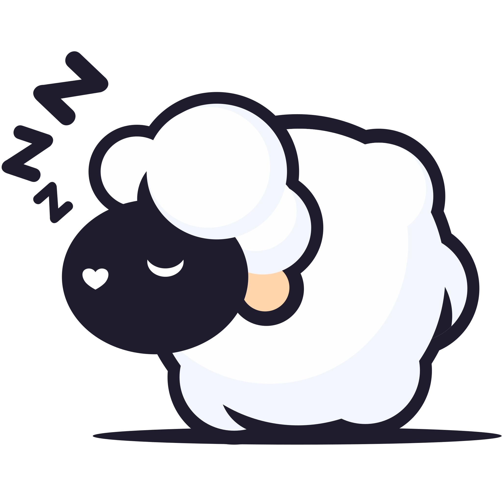

<p align="center">

<h1 align="center"> Nine Yards Doodle </h1>
</p>

> **Note**
>
> Nine Yards is still actively under development and is not yet ready for use. Please refer to our communication channels to follow development and find out when you can start using Nine Yards

Nine Yards Doodle is a whiteboard app originally desigined for the [Nine Yards](../README.md) project management tool but due to how useful we found it during development can be ran seperately. Locally in the browser as a PWA, or hosted for collabirative drawing. In addition Nine Yards Doodle can be used as a framework agnostic web component to embed it into your own projects.

---

## Features

TODO

---

## Hosting


TODO

---

## Emebedding


TODO

---

## Overiding styling


TODO

```css

```

---

## Want Help?


Have an issue, a feature requst or just want to ask a question? You can contact us over email, here on github or on discord in the server below

[![Discord][1]][2]

[1]: https://discordapp.com/api/guilds/1069326955742244884/widget.png?style=banner2
[2]: https://discord.gg/GJsQadv9Mc

You can find the API Documentation through the OpenAPI spec [here](https://raw.githubusercontent.com/Rabbitminers/Nine-Yards/master/openapi.json). Alternatively if enabled you can view the spec through [Swagger UI](https://swagger.io/tools/swagger-ui/) on the `/swagger-ui` endpoint of your instance.

---

## Licenses



Nine Yards is free and open source, and is licensed under [GNU GPLv3](./LICENSE) a summary of what this means can be found [here](https://choosealicense.com/licenses/gpl-3.0/).
